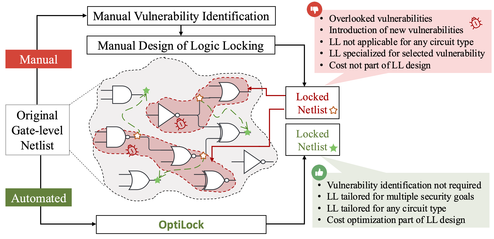
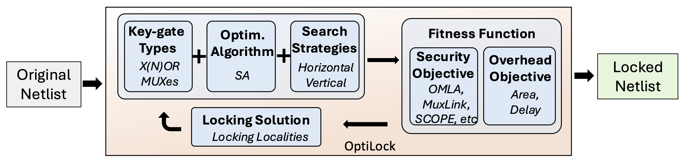

# OptiLock: Automated Optimization of Learning-Resilient Logic Locking

> 🏅 This work has been **accepted for publication in IEEE Access** (2025).

<p align="left">
  
</p>


Author: Zeng Wang, Lilas Alrahis, Animesh Basak Chowdhury, Dominik Germek, Ramesh Karri, Ozgur Sinanoglu

Abstract：Logic locking is a design-for-trust technique aiming to protect the intellectual property of integrated circuits from piracy throughout the global semiconductor supply chain. Logic locking inserts key-controlled elements (e.g., Boolean gates, referred to as key-gates) into the circuit. A secret locking key activates the functionality of the circuit, preventing unauthorized access to the design. However, the security of logic locking has been threatened by advanced machine learning-based attacks that rely solely on the structure of the locked circuit (i.e., gate-level netlist) to break logic locking and decipher the keys.

Manually identifying the vulnerabilities in logic locking design, in terms of the key-gate type chosen and the location of key-gate insertion, has proven insufficient in safeguarding logic locking. Therefore, we propose OptiLock, a first-of-its-kind automated logic locking framework that supports different types of key-gates and automatically finds learning-resilient places to insert the key-gates to thwart a specific attack on logic locking, without requiring any prior knowledge of how to thwart the attack. It employs a simulated annealing algorithm in addition to customized and adjustable fitness evaluation functions that allow OptiLock to find learning-resilient logic locking solutions in terms of security and implementation overhead.

OptiLock successfully thwarts four state-of-the-art attacks (MuxLink, OMLA, SCOPE, and SAAM) by optimizing the insertion of X(N)OR or multiplexer key-gates. Evaluations across ISCAS-85, ITC-99, EPFL, Ariane RISC-V benchmarks, and CVA6 RISC-V CPU design show that the proposed key-gate insertion is tailored to the original circuit structure, rather than relying on predefined locking strategies. Additionally, we demonstrate that OptiLock thwarts structural attacks such as SnapShot, Redundancy, and Resynthesis. Our evaluation further shows that OptiLock performs multi-objective optimization, achieving the desired security level while minimizing implementation costs, achieving an average delay reduction of 70.18% compared to random logic locking.


## Overview

Manual (traditional) Logic Locking (LL) vs. automated LL: manual LL is ad-hoc and attack-specific, while OptiLock automates key-gate placement to meet security goals with implementation costs. Red marks vulnerable manual selections; green marks resilient OptiLock selections. 


High-level overview of OptiLock: select key-gate (X(N)OR/MUX), circuit, and target attack (e.g., OMLA, MuxLink, SCOPE); outputs a locked netlist that thwarts the chosen attack with desired overhead.

## Environment Setup
### Conda Environment 
```
conda env create -f optilock.yml
```

### Extracting SCOPE Source Code

We provide designed code to process SCOPE attack key variants and calculate evaluation metrics including key accuracy, key precision, and KPA (Key Prediction Accuracy). These metrics are essential for assessing the effectiveness of our OptiLock framework against SCOPE attacks.

```
cd src
unzip SCOPE.zip
cd ..
```

### Preparing for MuxLink Attack

We provide pre-trained MuxLink ensemble models for four benchmark circuits: `c1355`, `c1908`, `b14_C`, and `b18_C`, located in the `ml_data_muxlink` directory. Each zip file contains `M=5` trained MuxLink models for circuits locked with randomly inserted gD-MUX gates.

**To use the pre-trained models:**
1. Navigate to the `ml_data_muxlink` directory
2. Extract the desired model file:
  ```
  unzip ml_data_c1355.zip
  ```
3. Quick look to structure of `ml_data_c1355.zip`
```
ml_data_c1355/
├── ml_data_c13551/   # start_num=1, which is indexed after circuit name c1355  
├── ml_data_c13552/ 
├── ml_data_c13553/ 
├── ml_data_c13554/ 
└── ml_data_c13555/  
```

Alternative:
You can train custom MuxLink models which can also be used in our framework. The training repository is available at [MuxLink](<https://github.com/lilasrahis/MuxLink>).

### Preparing for SCOPE Attack

We provide the SCOPE attack implementation for the `c1355` benchmark circuit. To use the provided attack:

```
  unzip SCOPE_c1355.zip
```

Alternative: 
You can download the SCOPE attack folder from this repo at [SCOPE](<https://github.com/alaql89/SCOPE>)

## OptiLock against MuxLink using MUX

As described in the manuscript, **OptiLock** offers two searching strategies to find resilient locking solutions against **MuxLink attacks**:

* **Horizontal Searching (HS)**
* **Vertical Searching (VS)**

This example shows how to launch the Horizontal Searching workflow.

---

### 🚀 Launching Horizontal Search (HS)

```bash
cd src
python OptiLock_MuxLink_HS_generation.py
cd ..
```

---

### 📂 Code Structure

* **`src/OptiLock_MuxLink_HS_generation.py`** – entry point; sets parameters and launches the search
* **`src/OptiLock_MuxLink_HS_Searching.py`** – core algorithm that searches for a resilient solution

---

### ⚙️ Key Parameters (set inside `OptiLock_MuxLink_HS_generation.py`)

| Parameter           | Purpose                                   | Example               |
| ------------------- | ----------------------------------------- | --------------------- |
| `start_num`         | Index of the first ensemble model file    | `1`                   |
| `total_num`         | Number of ensemble model files to include | `5`                   |
| `train_mark`         | If you want to train the model first  | `False`                   |
| `job_num`           | Replicated experiments to run             | `1`                   |
| `circuit_name_list` | Circuits to lock                          | `["c1355"]`           |
| `output_file`       | OptiLock-ed design                         | `optilock_c1355_locked.bench` |
| `key_size`       | Key size                        | `64` |
| `iter_num`          | Fixed number of iterations                | `10000`               |
| `bin_num`           | Search mode (`1` = HS, `1000` = VS)       | `1`                   |

> **Example** – With `start_num=1` and `total_num=5`, the dataset `ml_data_c1355.zip` should unpack to:
>
> ```
> ml_data_c13551/
> ml_data_c13552/
> ml_data_c13553/
> ml_data_c13554/
> ml_data_c13555/
> ```

---

#### 📌 Notes

* Ensure that the ensemble dataset (e.g., `ml_data_c1355.zip`) is extracted into the expected folder structure **before** running the script.
---

### 🚀 Launching Vertical Search (VS)

```bash
cd src
python OptiLock_MuxLink_VS_generation.py
cd ..
```
---
here we use provide the example code for `b14`, and correspondingly `bin_num = 1000` and `key_size = 256`.

## OptiLock against SCOPE using MUX

```bash
cd src
python OptiLock_SCOPE_generation.py
cd ..
```
---
here you only `start_num`, `total_num` are not required to set. `key_size` and `circuit_name_list` are only required to set up.
